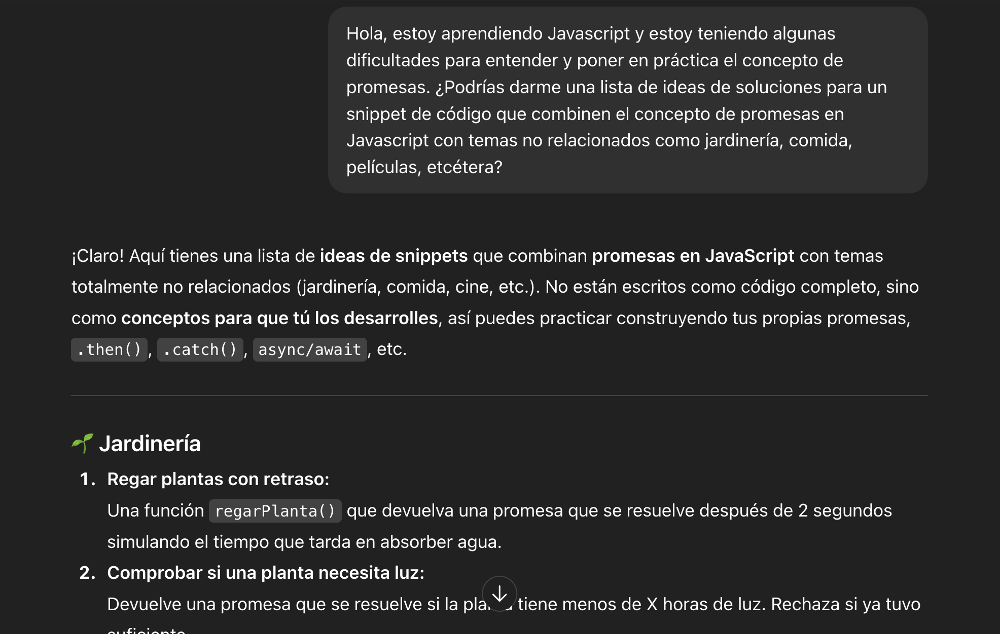
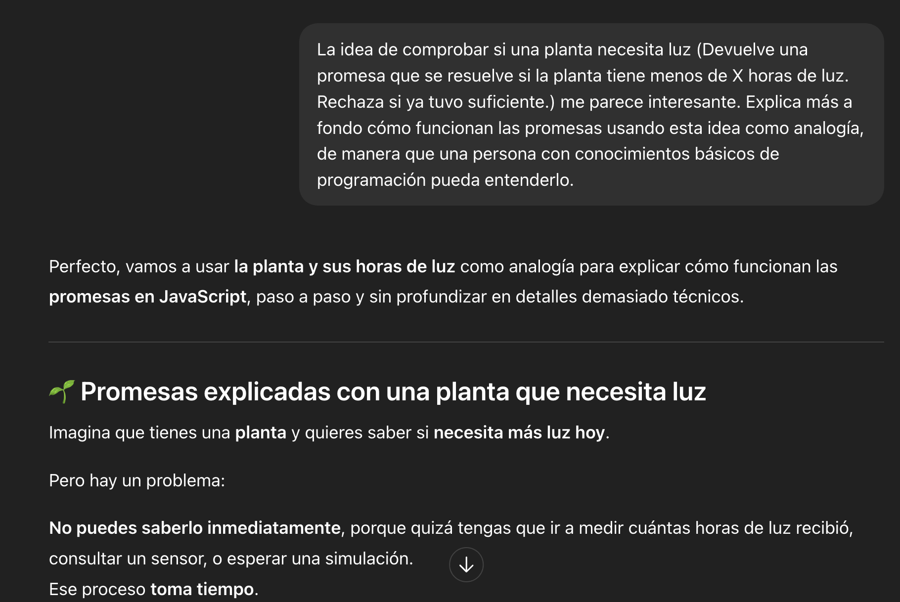
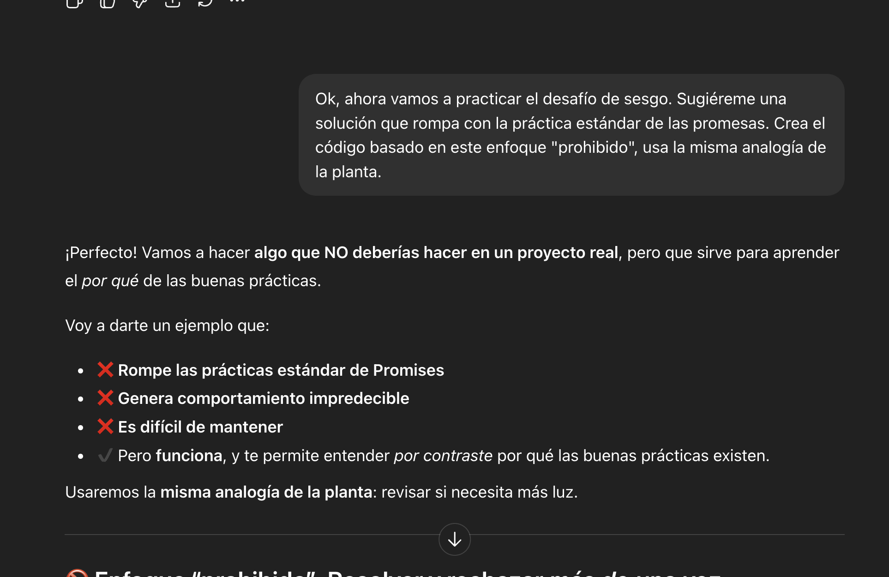

# **Pensamiento Creativo con IA | Javascript con Inteligencia Artificial**

---

## Descripción del problema de Javascript elegido.

> ***Prompt 1.** Hola, estoy aprendiendo Javascript y estoy teniendo algunas dificultades para entender y poner en práctica el concepto de promesas. ¿Podrías darme una lista de ideas de soluciones para un snippet de código que combine el concepto de promesas en Javascript con temas no relacionados como jardinería, comida, películas, etcétera?*
> 

<aside>
💡

> **Comprobar si una planta necesita luz: Devuelve una promesa que se resuelve si la planta tiene menos de X horas de luz. Rechaza si ya tuvo suficiente.**
> 
</aside>

> **Prompt 1.1: ***La idea de comprobar si una planta necesita luz (Devuelve una promesa que se resuelve si la planta tiene menos de X horas de luz. Rechaza si ya tuvo suficiente.) me parece interesante. Explica más a fondo cómo funcionan las promesas usando esta idea como analogía, de manera que una persona con conocimientos básicos de programación pueda entenderlo.*
> 

### 🌱 Promesas explicadas con una planta que necesita luz

Imagina que tienes una **planta** y quieres saber si **necesita más luz hoy**.

Pero hay un problema:

**No puedes saberlo inmediatamente**, porque quizá tengas que ir a medir cuántas horas de luz recibió, consultar un sensor, o esperar una simulación.

Ese proceso **toma tiempo**.

En programación, cuando algo **tarda**, usamos **promesas**.

En programación, cuando algo **tarda**, usamos **promesas**.

---

### 1. ¿Qué es una promesa?

Una **Promesa** en JavaScript es un **objeto** que **representa una tarea en proceso**, algo que *todavía no sabemos si terminará bien o mal*.

En la analogía:

> “Prometo decirte si la planta necesita más luz, pero dame un momento para revisar”.
> 

La promesa puede terminar de dos formas:

| Estado de la promesa | Significado | En la analogía |
| --- | --- | --- |
| ✔️ **resolve** | Todo salió bien | La planta **sí necesita** luz |
| ❌ **reject** | Hubo un problema / no cumple | La planta **ya tuvo suficiente** luz |

---

### 2. Crear una promesa (la función jardinera)

Vamos a imaginar una función llamada `checarLuz()`:

- Recibe cuántas horas de luz tuvo la planta hoy.
- Devuelve una **promesa**.
- Esa promesa va a decidir si se resuelve o se rechaza.

```jsx
function checarLuz(horasActuales) {
  return new Promise((resolve, reject) => {
    // Simulamos un pequeño retraso, como si checaras un sensor
    setTimeout(() => {
      const horasNecesarias = 6;

      if (horasActuales < horasNecesarias) {
        resolve("La planta necesita más luz 🌞");
      } else {
        reject("La planta ya tuvo suficiente luz 🌥️");
      }

    }, 1500);
  });
}

```

En palabras simples:

- La promesa **promete** decirte si hace falta más luz.
- Después de 1.5 segundos te da una respuesta.
- Si necesita más luz: **resolve**
- Si ya tuvo suficiente: **reject**

---

### 3. Consumir la promesa (recibir la respuesta)

Así como un jardinero espera una respuesta, tú esperas a que la promesa termine:

```jsx
checarLuz(3)
  .then((mensaje) => {
    // Esto se ejecuta si hubo "resolve"
    console.log("✔️ Éxito:", mensaje);
  })
  .catch((error) => {
    // Esto se ejecuta si hubo "reject"
    console.log("❌ Error:", error);
  });

```

Esto funciona así:

- `.then()` = Qué hacer **cuando todo salió bien**.
- `.catch()` = Qué hacer **si salió mal o no cumplió la condición**.

---

### 4. ¿Por qué existe todo este proceso?

Si calcular algo fuera instantáneo, no necesitaríamos promesas.

Pero JavaScript es **asíncrono**, lo que significa:

> Puede seguir haciendo otras cosas mientras espera una respuesta.
> 

La planta sigue ahí, absorbiendo luz, mientras el código:

- Mide horas,
- Espera un sensor,
- O simula un proceso lento.

Las promesas permiten que tu programa **no se congele**.

---

### 5. Con `async/await` la analogía es aún más natural

Esto es como preguntar:

> “¿Necesita luz? Espero tu respuesta.”
> 

```jsx
async function revisar() {
  try {
    const resultado = await checarLuz(3);
    console.log(resultado); // Si necesita luz
  } catch (error) {
    console.log(error);     // Si no la necesita
  }
}

revisar();

```

`await` significa:

**"Pausa aquí hasta que la promesa termine."**

---

## Desarrollo y desafío de sesgo

### 🚫 Enfoque “prohibido”: Resolver y rechazar *más de una vez*

La idea general es crear una función que devuelva una promesa cuyo comportamiento sea incorrecto, caótico y contrario a las buenas prácticas. Seguirás usando la analogía de revisar si una planta necesita más luz.

Lo que vas a hacer es:

1. Crear una promesa.
2. Resolver o rechazar **solo una vez al inicio**, dependiendo de si la planta tiene suficiente luz.
3. Luego, de manera intencional, intentar:
    - Resolver de nuevo más tarde.
    - Rechazar después de ya haber resuelto.
    - Ejecutar lógica adicional y aleatoria que intenta resolver o rechazar otra vez.
4. Todo esto para demostrar que:
    - La promesa solo hace caso al **primer** resultado.
    - Todo lo demás es ignorado silenciosamente.
    - Es un pésimo diseño que causa confusión.

---

### 😈 Cómo estructurar este anti-patrón

**1. Empieza la función**

Define una función que reciba las horas de luz de la planta y que regrese una promesa. Dentro de esa promesa, escribe un mensaje inicial, como “iniciando revisión de la planta”.

**2. Primer resultado correcto**

Dentro de la función que recibe `resolve` y `reject`, haz la comparación inicial:

- Si las horas son menores al mínimo deseado, llama a la función que representa el “éxito”.
- Si no, llama a la que representa el “rechazo”.

Esta parte está bien hecha, pero es lo único correcto en todo el snippet.

**3. Intento de resolver otra vez (incorrecto)**

Programa un temporizador pequeño (como un segundo) y, dentro de él, vuelve a llamar a la función de “éxito”.

Acompaña esto con un mensaje advirtiendo que estás haciendo algo indebido, como “intentando resolver otra vez”.

**4. Intento de rechazar luego de haber resuelto (más incorrecto)**

Agrega otro temporizador, un poco más tardío, y dentro intenta llamar a la función que representaría “rechazo”.

Incluye otro aviso, indicando que esta acción es aún peor porque estás intentando cambiar el estado después de haberlo definido.

**5. Lógica mezclada y confusa (extremadamente incorrecto)**

Agrega un tercer temporizador donde generes una condición aleatoria.

Según el resultado, haz que el temporizador llame a la función de éxito o de rechazo nuevamente, junto con un mensaje señalando que esta mezcla de decisiones y lógica es absurda y mala práctica.

Todo esto servirá para demostrar cómo JavaScript **ignora** cualquier intento extra de resolución o rechazo después del primero.

---

### 🔍 Qué ocurre realmente

Cuando ejecutes este diseño:

- La promesa solo toma en cuenta **el primer** llamado correcto, ya sea éxito o rechazo.
- Todos los llamados posteriores —aunque estén programados y parezcan ejecutarse— **no cambian el estado** de la promesa.
- Los mensajes de advertencia sí aparecerán, pero no afectarán el flujo.

Es un ejemplo perfecto de un anti-patrón porque genera una falsa impresión de que la promesa podría cambiar de opinión, cuando el lenguaje no lo permite.

---

### 🧠 Por qué este ejemplo te enseña algo útil

Ver este tipo de error de forma controlada te ayuda a comprender:

- Que las promesas son **inmutables** tras su primer resultado.
- Que intentar re-resolverlas crea confusión para quien lea el código.
- Que mezclar tiempos, decisiones y llamadas fuera de control puede generar bugs difíciles de rastrear.
- Y que, por contraste, las buenas prácticas tienen sentido.

```jsx
function checarLuzMal(horasActuales) {
  return new Promise((resolve, reject) => {
    console.log("🌱 Iniciando revisión de la planta...");

    // Primer chequeo (válido)
    if (horasActuales < 6) {
      resolve("La planta necesita más luz 🌞");
    } else {
      reject("La planta ya tuvo suficiente luz 🌥️");
    }

    // ❌ Intento de resolver de nuevo (es ignorado)
    setTimeout(() => {
      console.warn("⚠️ Intentando resolver otra vez... ¡esto es mala práctica!");
      resolve("Resolución duplicada: esto NO debería pasar");
    }, 1000);

    // ❌ Intento de rechazar después de resolver (también ignorado)
    setTimeout(() => {
      console.warn("⚠️ Intentando rechazar después de resolver... peor aún");
      reject("Rechazo tardío: ya era tarde para cambiar de opinión");
    }, 1500);

    // ❌ Combinación de lógica mezclada SIN control de flujo
    setTimeout(() => {
      console.warn("⚠️ Lógica confusa: revisando de nuevo sin sentido");
      if (Math.random() > 0.5) {
        resolve("Resultado aleatorio que nunca se verá");
      } else {
        reject("Otro error que no llegará a nadie");
      }
    }, 2000);
  });
}

checarLuzMal(3)
  .then((resultado) => {
    console.log("✔️ Resultado recibido:", resultado);
  })
  .catch((err) => {
    console.log("❌ Error recibido:", err);
  });
```
---

## Evidencia de prompts:








## Análisis de optimización

> *Prompt: Por favor, evalúa este código. Revisa su legibilidad, funcionamiento, posibles bugs que pudieran generarse, toma también en cuenta buenas prácticas y en base a este análisis sugiéreme mínimamente dos optimizaciones que pudieran mejorarlo.*
> 

### ✅ **Legibilidad**

El código es muy legible para alguien que ya sabe que es un ejemplo “mal hecho”:

- Está bien comentado.
- Usa emojis que facilitan entender la intención.
- Los mensajes en consola son claros sobre lo que está mal.
- El flujo se sigue fácilmente.

Sin embargo, visto desde el punto de vista de buenas prácticas:

- La función está demasiado larga y hace demasiadas cosas.
- Mezcla decisiones sin motivo.
- Los `setTimeout` se superponen de forma caótica.

---

### ⚙️ **Funcionamiento real**

Esto es importante:

- La promesa **se resuelve o rechaza inmediatamente** con el primer `if`.
- Los siguientes `resolve()` y `reject()` son **ignorados silenciosamente**.
- Los `setTimeout` sí ejecutan sus `console.warn()`, pero **no afectan el estado final**.
- La ejecución del `.then()` o `.catch()` depende *únicamente* del primer resultado.

En otras palabras:

> El 95% del trabajo que hace esta función es inútil, porque Promise solo toma el primer resultado.
> 

---

### 🐛 **Posibles bugs / problemas reales en un entorno de producción**

Aunque este código es deliberadamente incorrecto, si algo así existiera en producción generaría:

❗ 1. **“Zombies lógicos” o acciones tardías sin propósito**

Los `setTimeout` siguen ejecutándose, incluso cuando ya no sirven.

En un sistema real esto podría causar:

- logs excesivos
- funciones extra ejecutándose
- efectos secundarios no deseados

❗ 2. **Condiciones de carrera invisibles**

La condición aleatoria del tercer `setTimeout` crea comportamiento **no determinista** que confunde a cualquier desarrollador que lea el código.

❗ 3. **Estado interno imposible de predecir**

Si esta promesa disparara acciones reales (peticiones HTTP, escrituras, etc.) después del primer resolve, los resultados serían inconsistentes.

❗ 4. **Dificultad extrema para depuración**

El código se ve vivo, pero la promesa ya está “cerrada”.

Esto hace que un desarrollador pierda tiempo buscando un bug que en realidad no puede ocurrir.

---

### ⭐ **Buenas prácticas que rompes intencionalmente** (y está bien para este ejercicio)

1. Resolver o rechazar varias veces.
2. Mezclar lógica aleatoria sin control.
3. Crear temporizadores innecesarios.
4. No encapsular la lógica en funciones más pequeñas.
5. No retornar después de `resolve` o `reject`.
6. Ejecutar código residual después del primer resultado.

Esta lista te sirve para recordar qué evitar en código real.

---

### 🔧 **Sugerencias de optimización**

✅ **Optimización 1: Detener la ejecución después de resolver/rechazar**

En un entorno correcto, deberías usar `return` después de:

```
resolve(...)

```

o

```
reject(...)

```

Esto evita que se ejecute lógica innecesaria.

En este código no es necesario (porque es un ejemplo), pero sí sería una optimización profesional.

---

✅ **Optimización 2: Eliminar temporizadores que ejecutan lógica inservible**

Los `setTimeout` solo generan ruido.

Una versión optimizada usaría **un solo punto de decisión** o una cadena clara de pasos.

---

## Conclusión
Después de hacer todo este ejercicio, considero que mi comprensión de las promesas en JavaScript mejoró. La analogía de la planta y las horas de luz me ayudó a visualizar mejor qué significa que una promesa se resuelva o se rechace, y también entendí mejor por qué no podemos “resolver” o “rechazar” varias veces. 

El experimento del “código con sesgo” funcionó para mostrarme claramente qué NO se debe hacer, aunque probablemente había formas más sencillas de entender el concepto sin complicarlo tanto. Aun así, el proceso completo me sirvió para reforzar mi entendimiento y mi manera de abordar la IA como una herramienta que permite abordar problemas o situaciones de una manera innovadora, o desde un punto de vista no contemplado anteriormente.